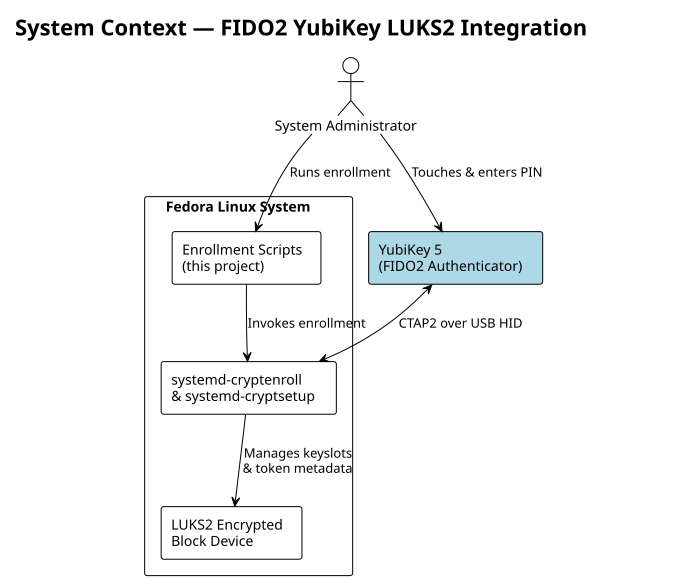
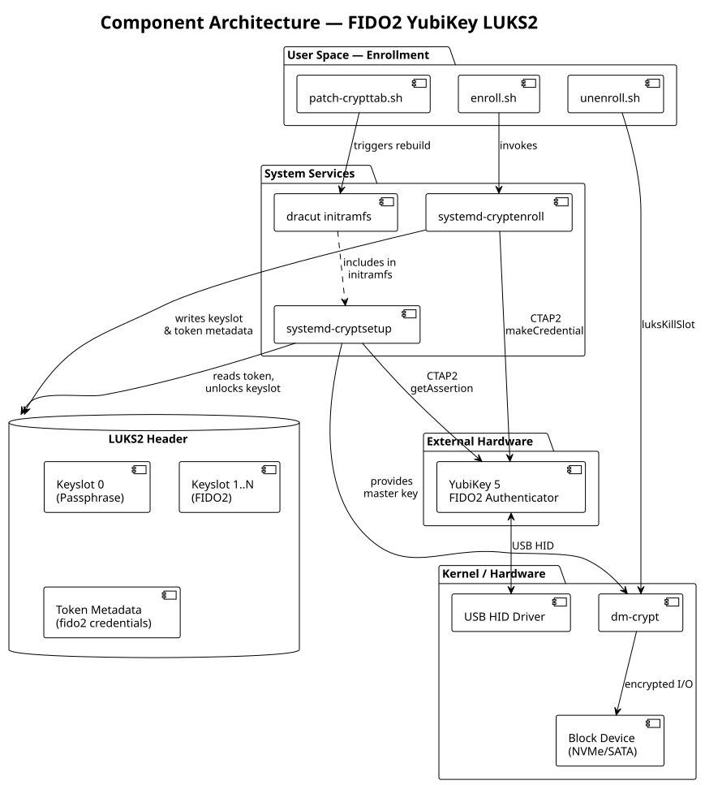
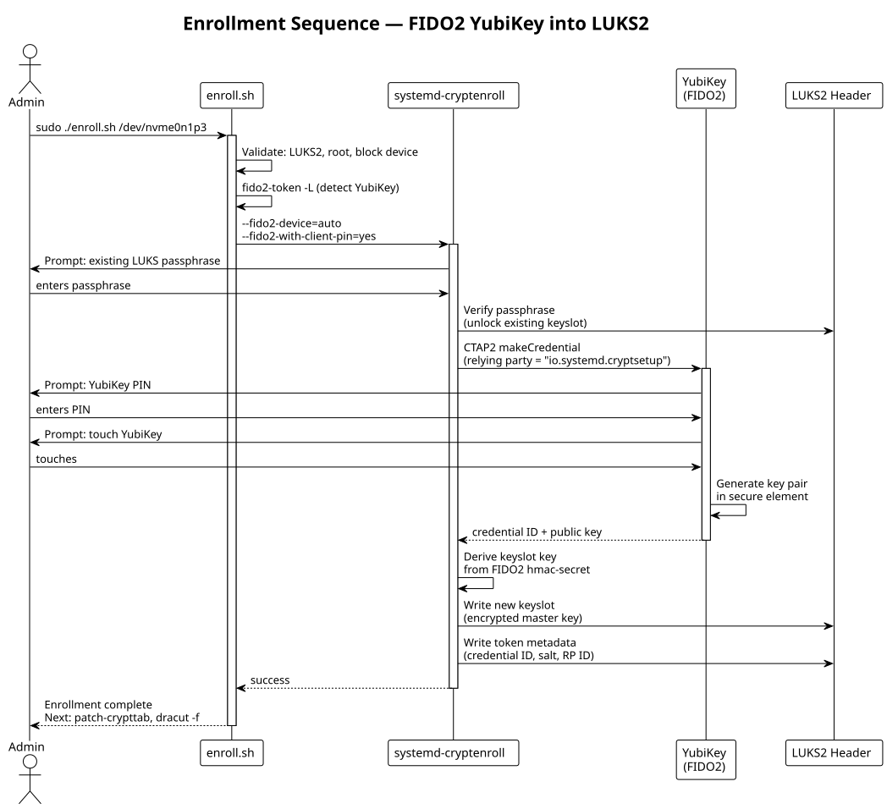
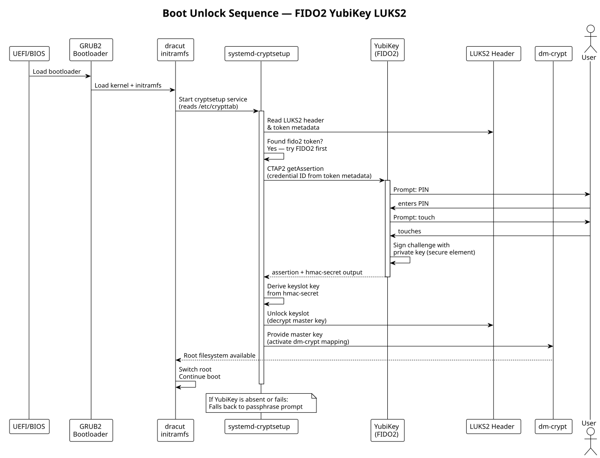
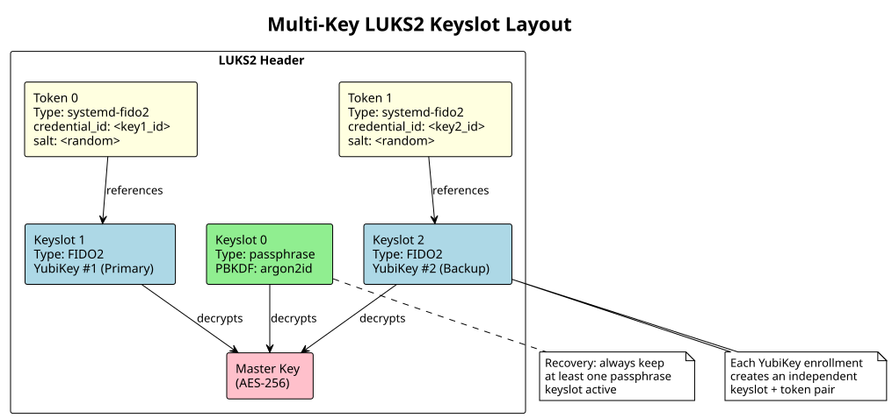
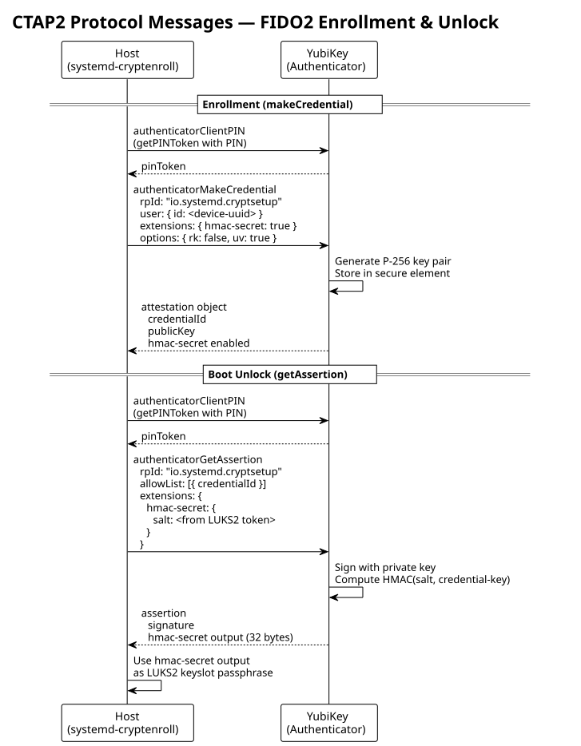
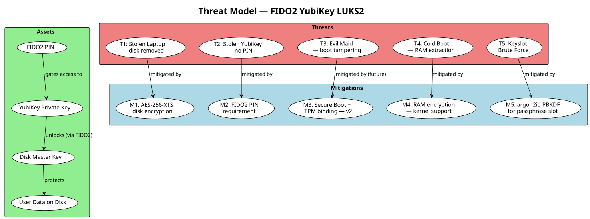
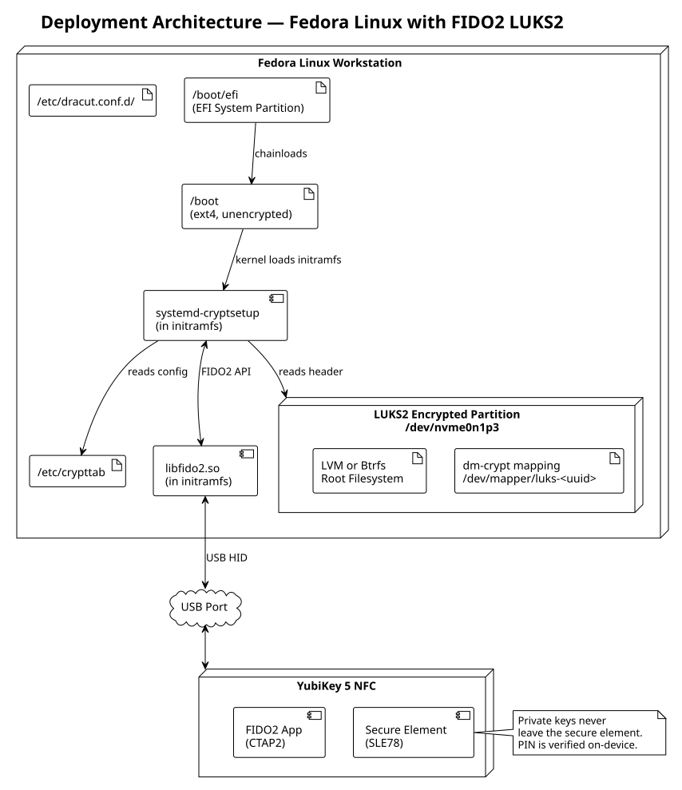
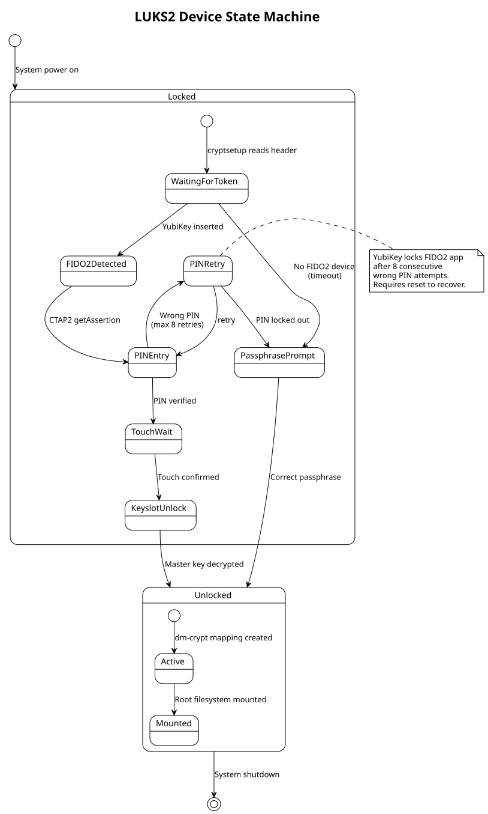
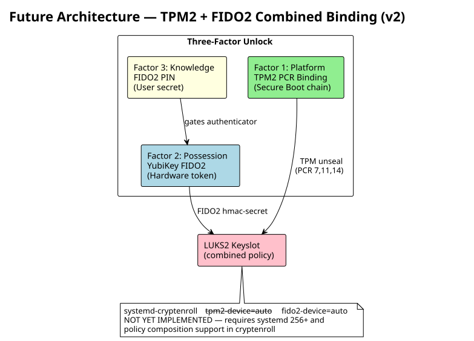

# System Architecture Document

## FIDO2 YubiKey LUKS2 Integration for Fedora Linux

| Field | Value |
|-------|-------|
| Document ID | ARCH-001 |
| Version | 1.0 |
| Status | Approved for Implementation |
| Classification | Technical Architecture |

---

## 1. Purpose and Scope

### 1.1 Purpose

This document defines the system architecture for integrating Yubico YubiKey FIDO2 hardware security tokens with LUKS2 full disk encryption on Fedora Linux. It describes the components, interfaces, data flows, and security boundaries involved in using a YubiKey as a second authentication factor for disk unlock at boot time.

### 1.2 Scope

- FIDO2/CTAP2 credential enrollment into LUKS2 token metadata via `systemd-cryptenroll`
- Boot-time unlock via `systemd-cryptsetup` with FIDO2 device auto-detection
- Multi-key enrollment for operational redundancy
- Passphrase fallback for recovery scenarios

### 1.3 Out of Scope (Planned Future Work)

- TPM2 + FIDO2 combined binding (planned for v2)
- Remote/network-based unlock
- YubiKey HMAC-SHA1 challenge-response mode (legacy approach)

---

## 2. Reference Documents

### 2.1 Vendor Documentation

| Source | Document | URL |
|--------|----------|-----|
| Yubico | YubiKey 5 Series Technical Manual | https://docs.yubico.com/hardware/yubikey-5-overview.html |
| Yubico | FIDO2/WebAuthn Overview | https://developers.yubico.com/FIDO2/ |
| Yubico | CTAP2 Client PIN Specification | https://developers.yubico.com/FIDO2/Concepts/CTAP2_Client_PIN.html |
| Yubico | YubiKey Manager CLI Guide | https://docs.yubico.com/software/yubikey/tools/ykman/ |
| Red Hat | LUKS2 Disk Encryption (RHEL 9) | https://docs.redhat.com/en/documentation/red_hat_enterprise_linux/9/html/security_hardening/encrypting-block-devices-using-luks |
| Red Hat | systemd-cryptenroll Manual | https://www.freedesktop.org/software/systemd/man/systemd-cryptenroll.html |
| Red Hat | Configuring LUKS with FIDO2 | https://docs.redhat.com/en/documentation/red_hat_enterprise_linux/9/html/security_hardening/unlocking-a-luks-encrypted-volume-by-a-fido2-key |
| Fedora | Full Disk Encryption Guide | https://docs.fedoraproject.org/en-US/quick-docs/encrypting-drives-using-LUKS/ |
| FIDO Alliance | CTAP2.1 Specification | https://fidoalliance.org/specs/fido-v2.1-ps-20210615/fido-client-to-authenticator-protocol-v2.1-ps-20210615.html |

### 2.2 Standards

| Standard | Description |
|----------|-------------|
| FIDO2 CTAP2.1 | Client to Authenticator Protocol — defines USB/NFC/BLE communication between host and authenticator |
| WebAuthn Level 2 | W3C standard for web authentication using public key credentials |
| LUKS2 On-Disk Format | Linux Unified Key Setup version 2 specification (extensible token metadata) |
| PKCS#5 / PBKDF2 | Password-based key derivation for passphrase keyslots |
| AES-256-XTS | Default cipher for LUKS2 data encryption |

---

## 3. System Context

### 3.1 System Context Diagram



### 3.2 Stakeholders

| Stakeholder | Role | Concern |
|-------------|------|---------|
| System Administrator | Enrolls keys, manages disk encryption | Usability, key management |
| End User | Boots system daily | Boot speed, fallback availability |
| Security Auditor | Reviews encryption posture | Compliance, key strength, attack surface |
| IT Operations | Manages fleet of machines | Multi-key support, recovery procedures |

---

## 4. Component Architecture

### 4.1 Component Diagram



### 4.2 Component Descriptions

| Component | Type | Responsibility |
|-----------|------|---------------|
| `enroll.sh` | Shell script | Validates device, detects YubiKey, invokes `systemd-cryptenroll` with FIDO2+PIN options |
| `unenroll.sh` | Shell script | Identifies and removes FIDO2 keyslots from LUKS2 header |
| `patch-crypttab.sh` | Shell script | Adds `fido2-device=auto` to `/etc/crypttab` entries, triggers initramfs rebuild |
| `systemd-cryptenroll` | System binary | Creates FIDO2 credentials on the YubiKey and stores the credential ID + salt in LUKS2 token metadata; derives and stores a key in a LUKS2 keyslot |
| `systemd-cryptsetup` | System service | At boot, reads LUKS2 token metadata, performs FIDO2 assertion with YubiKey, derives the keyslot unlock key |
| `dracut` | Initramfs generator | Packages FIDO2 libraries (`libfido2`) and `systemd-cryptsetup` into the initial boot environment |
| `dm-crypt` | Kernel module | Transparent block-level encryption/decryption using the master key |
| YubiKey 5 | Hardware | FIDO2 authenticator; generates and stores private keys in secure element; performs CTAP2 operations |

---

## 5. Data Flow Architecture

### 5.1 Enrollment Sequence



### 5.2 Boot Unlock Sequence



### 5.3 Multi-Key Enrollment



---

## 6. Interface Specifications

### 6.1 External Interfaces

| Interface | Protocol | Direction | Description |
|-----------|----------|-----------|-------------|
| YubiKey USB | CTAP2 over USB HID | Bidirectional | FIDO2 credential creation and assertion |
| LUKS2 Header | On-disk format | Read/Write | Keyslot and token metadata storage |
| `/etc/crypttab` | Text configuration | Read (at boot) | Tells systemd which devices to unlock and how |
| dracut initramfs | Binary image | Generated | Contains all libraries/binaries needed at boot |

### 6.2 CTAP2 Protocol Flow



---

## 7. Security Architecture

### 7.1 Threat Model



### 7.2 Security Boundaries

| Boundary | Inside | Outside | Protection |
|----------|--------|---------|------------|
| YubiKey Secure Element | Private keys, PIN retry counter | Host software | Hardware isolation, tamper resistance |
| LUKS2 Header | Encrypted master key, token metadata | Unencrypted disk | AES key wrapping, argon2id |
| Initramfs | Boot-time unlock logic | User space | Signed kernel + Secure Boot (recommended) |
| PIN | User's knowledge | All other factors | Rate-limited on YubiKey (8 retries, then lockout) |

### 7.3 Authentication Factors

| Factor | Type | Component | Compromise Impact |
|--------|------|-----------|-------------------|
| YubiKey possession | Something you have | Hardware token | Attacker needs PIN to use |
| FIDO2 PIN | Something you know | Entered at boot | Attacker needs the physical key |
| Touch confirmation | Something you do | Capacitive sensor | Prevents remote/malware use of inserted key |
| TPM platform binding (v2) | Something you are (platform) | TPM 2.0 PCR values | Prevents boot from tampered system |

---

## 8. Deployment Architecture

### 8.1 Deployment Diagram



### 8.2 File Layout

```
/
├── etc/
│   ├── crypttab                        # fido2-device=auto entry
│   └── dracut.conf.d/
│       └── fido2.conf                  # (optional) force inclusion
├── usr/
│   └── lib/
│       └── systemd/
│           ├── systemd-cryptsetup      # boot-time unlock binary
│           └── system/
│               └── systemd-cryptsetup@.service
├── boot/
│   └── initramfs-<version>.img         # contains libfido2 + cryptsetup
└── dev/
    ├── nvme0n1p3                       # LUKS2 encrypted partition
    └── mapper/
        └── luks-<uuid>                 # decrypted block device
```

---

## 9. State Machine

### 9.1 LUKS2 Device States



---

## 10. Future Architecture: TPM + FIDO2

### 10.1 Planned v2 Architecture



### 10.2 TPM+FIDO2 Design Considerations

| Consideration | Detail |
|---------------|--------|
| PCR Policy | Bind to PCR 7 (Secure Boot), 11 (systemd-stub), 14 (shim MOK) |
| Composition | TPM unseal provides first key half; FIDO2 provides second |
| Fallback | If TPM PCRs change (kernel update), passphrase still works |
| Enrollment | Requires two sequential enrollment steps or combined systemd-cryptenroll call |
| systemd version | Requires systemd 256+ for combined FIDO2+TPM2 in single keyslot |

---

## Appendix A: Glossary

| Term | Definition |
|------|-----------|
| LUKS2 | Linux Unified Key Setup version 2 — on-disk format for encrypted block devices supporting extensible token metadata |
| FIDO2 | Fast Identity Online 2 — authentication standard using public-key cryptography with hardware authenticators |
| CTAP2 | Client to Authenticator Protocol version 2 — defines communication between host and FIDO2 authenticator over USB/NFC/BLE |
| hmac-secret | FIDO2 extension that computes HMAC-SHA-256 of a salt using a per-credential key on the authenticator |
| Keyslot | LUKS2 slot containing an encrypted copy of the master key, protected by a passphrase or other secret |
| Token Metadata | LUKS2 extensible metadata area storing auxiliary data (e.g., FIDO2 credential ID and salt) |
| dm-crypt | Linux kernel module providing transparent block-level encryption |
| PCR | Platform Configuration Register — TPM measurement register reflecting boot chain integrity |
| argon2id | Memory-hard password hashing function used by LUKS2 for passphrase key derivation |
| Secure Element | Tamper-resistant hardware component in YubiKey that stores and operates on private keys |
