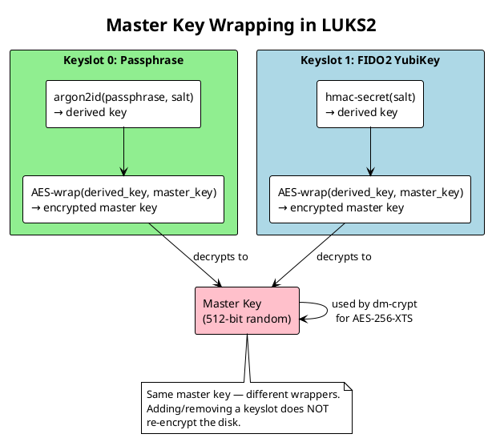
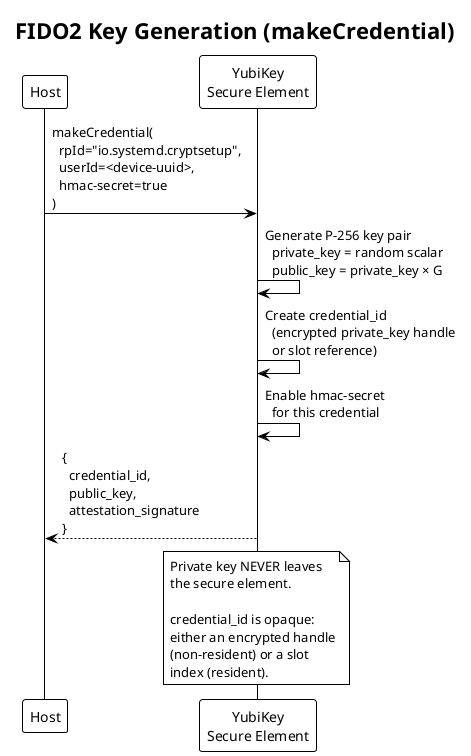
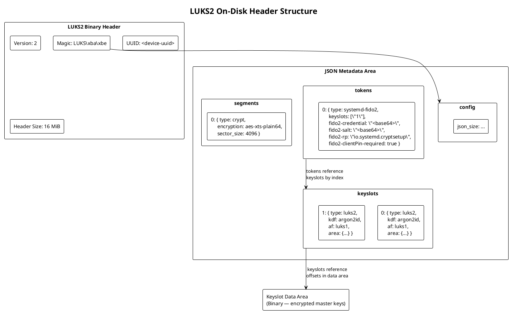
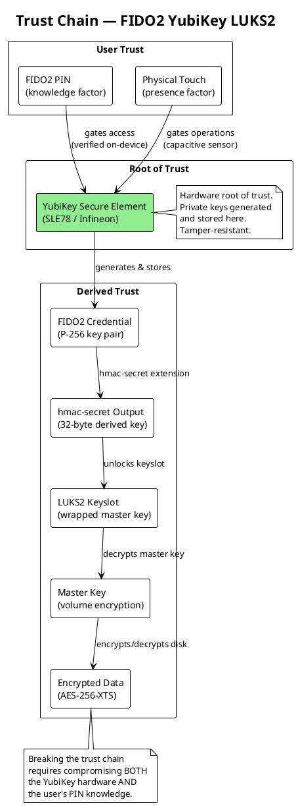

# Encryption Fundamentals

## Cryptographic Principles Underlying FIDO2 YubiKey LUKS2 Integration

---

## 1. Introduction

This document explains the cryptographic primitives, protocols, and trust relationships that make YubiKey-based LUKS2 disk encryption secure. It is intended for system administrators and security engineers who need to understand *why* the system is secure, not just *how* to operate it.

---

## 2. Symmetric Encryption: Protecting Data at Rest

### 2.1 AES-256-XTS

LUKS2 uses **AES-256 in XTS mode** as the default cipher for disk encryption.

**AES (Advanced Encryption Standard)** is a symmetric block cipher operating on 128-bit blocks with a 256-bit key. It is approved by NIST (FIPS 197) and is the standard for classified US government data.

**XTS (XEX-based Tweaked CodeBook mode with Ciphertext Stealing)** is a block cipher mode specifically designed for storage encryption (IEEE 1619-2007). It provides:

- **Sector-level independence**: Each disk sector is encrypted independently, allowing random access without decrypting the entire disk.
- **Tweak value**: Each sector uses a unique tweak derived from the sector number, preventing identical plaintext sectors from producing identical ciphertext.
- **No authentication tag**: XTS does not provide integrity protection. An attacker with physical access can modify ciphertext, producing garbled (but not chosen) plaintext. This is a known trade-off for full-disk encryption where performance and random access are critical.

**Key size**: XTS uses two 256-bit keys (512 bits total) — one for encryption and one for tweak computation.

```
Ciphertext = AES-256-XTS(MasterKey, SectorNumber, Plaintext)
```

### 2.2 The Master Key

The LUKS2 **master key** (also called the volume key) is a random 512-bit value generated once during `luksFormat`. This key directly encrypts the disk via `dm-crypt`.

The master key is never stored in plaintext on disk. Instead, it is encrypted (wrapped) by each keyslot's derived key. This architecture allows multiple keyslots — each with a different passphrase, FIDO2 credential, or TPM binding — to independently decrypt the same master key.



---

## 3. Key Derivation: From Passphrase to Key

### 3.1 argon2id (Passphrase Keyslots)

LUKS2 uses **argon2id** (RFC 9106) for passphrase-based key derivation. argon2id is a memory-hard function that resists both GPU-based and ASIC-based brute-force attacks.

Parameters stored in the LUKS2 header:

| Parameter | Typical Value | Purpose |
|-----------|--------------|---------|
| Memory | 1 GiB | Memory cost — forces attacker to use significant RAM per guess |
| Iterations | 4 | Time cost — number of passes over memory |
| Parallelism | 4 | Threads — matches typical CPU core count |
| Salt | 32 bytes random | Prevents precomputation / rainbow tables |

```
derived_key = argon2id(passphrase, salt, memory=1GiB, iterations=4, parallelism=4)
master_key  = AES-unwrap(derived_key, encrypted_master_key_from_keyslot)
```

### 3.2 FIDO2 hmac-secret (YubiKey Keyslots)

For FIDO2 keyslots, the key derivation is fundamentally different. Instead of stretching a human-chosen passphrase, the YubiKey provides a **hardware-derived secret** via the CTAP2 `hmac-secret` extension.

The process:

1. `systemd-cryptenroll` stores a random **salt** (32 bytes) in the LUKS2 token metadata.
2. At unlock time, this salt is sent to the YubiKey.
3. The YubiKey computes `HMAC-SHA-256(credential_key, salt)` inside its secure element.
4. The 32-byte output is used directly as the keyslot passphrase — no further key derivation is needed because the key material is already high-entropy.

```
hmac_output   = YubiKey.hmac_secret(credential_key, salt)  // 32 bytes, hardware-derived
derived_key   = argon2id(hmac_output, keyslot_salt, ...)   // LUKS2 still applies PBKDF
master_key    = AES-unwrap(derived_key, encrypted_master_key)
```

**Why this is secure**: The `credential_key` never leaves the YubiKey's secure element. An attacker with only the LUKS2 header cannot compute the hmac-secret output without possessing the physical YubiKey and knowing its PIN.

---

## 4. Asymmetric Cryptography: FIDO2 Authentication

### 4.1 Elliptic Curve Cryptography (P-256)

FIDO2 authenticators use **ECDSA on the NIST P-256 curve** (secp256r1) for credential key pairs.

- **Private key**: 256-bit scalar, generated and stored in the YubiKey's secure element. Never exported.
- **Public key**: Point on the P-256 curve, returned to the host during `makeCredential`.
- **Signature**: ECDSA signature over a challenge, used in `getAssertion` to prove possession of the private key.

### 4.2 Key Generation (makeCredential)

During enrollment, the YubiKey generates a new P-256 key pair:



### 4.3 Authentication (getAssertion)

At boot, the host sends the stored `credential_id` and a random challenge to the YubiKey:

1. YubiKey looks up the credential by ID.
2. User enters PIN (verified on-device by the YubiKey).
3. User touches the YubiKey (physical presence check).
4. YubiKey signs the challenge with the private key (ECDSA-P256-SHA256).
5. YubiKey computes `hmac-secret` output using the provided salt.
6. Host uses the hmac-secret output to unlock the LUKS2 keyslot.

---

## 5. The LUKS2 On-Disk Format

### 5.1 Header Structure



### 5.2 Token Metadata (FIDO2)

The LUKS2 token metadata for a FIDO2 keyslot contains:

| Field | Description |
|-------|-------------|
| `type` | `"systemd-fido2"` |
| `keyslots` | Array of keyslot indices this token can unlock (e.g., `["1"]`) |
| `fido2-credential` | Base64-encoded CTAP2 credential ID |
| `fido2-salt` | Base64-encoded 32-byte random salt for hmac-secret |
| `fido2-rp` | Relying party ID: `"io.systemd.cryptsetup"` |
| `fido2-clientPin-required` | `true` — PIN is mandatory |
| `fido2-up-required` | `true` — user presence (touch) is mandatory |

This metadata is stored **unencrypted** in the LUKS2 JSON header area. This is safe because:
- The credential ID is opaque and useless without the physical YubiKey.
- The salt is random and reveals nothing without the hmac-secret computation (which requires the YubiKey).
- The relying party ID is a fixed, known string.

---

## 6. Trust Chain

### 6.1 Trust Relationships



### 6.2 What Each Component Protects Against

| Attack | Protection | Component |
|--------|-----------|-----------|
| Disk theft | AES-256-XTS encryption | dm-crypt + master key |
| Key extraction from disk | Master key wrapped per-keyslot | LUKS2 keyslots |
| Passphrase brute force | argon2id memory-hard KDF | LUKS2 passphrase keyslot |
| FIDO2 credential theft | Private key in secure element | YubiKey hardware |
| Stolen YubiKey | PIN required (8 retries then lockout) | CTAP2 clientPIN |
| Remote/malware use of inserted key | Touch required | YubiKey capacitive sensor |
| Replay attack | Random challenge per assertion | CTAP2 protocol |

---

## 7. PIN Security

### 7.1 How the FIDO2 PIN Works

The FIDO2 PIN is **not** sent to the host. It is verified entirely on-device:

1. Host sends `clientPIN` command with a **PIN hash** encrypted under a shared secret (established via ECDH key agreement between host and authenticator).
2. YubiKey decrypts and verifies the PIN hash against its stored PIN hash.
3. If correct, YubiKey returns a `pinToken` — a session key for subsequent operations.
4. If incorrect, the retry counter decrements. After **8 consecutive failures**, the FIDO2 application locks and requires a full reset (which destroys all credentials).

### 7.2 PIN Entropy

FIDO2 PINs have a minimum length of **4 characters** (UTF-8). Because the PIN is rate-limited by hardware (8 retries), even a short PIN provides strong protection:

| PIN Length | Keyspace (digits only) | Brute Force with 8 Attempts |
|-----------|----------------------|---------------------------|
| 4 digits | 10,000 | 0.08% chance |
| 6 digits | 1,000,000 | 0.0008% chance |
| 8 chars (alphanumeric) | ~2.8 × 10¹⁴ | Negligible |

The hardware retry limit makes PIN brute force impractical regardless of PIN complexity.

---

## 8. Comparison: Passphrase-Only vs. FIDO2

| Property | Passphrase Only | FIDO2 + PIN |
|----------|----------------|-------------|
| Factors | 1 (knowledge) | 2 (possession + knowledge) |
| Brute force resistance | argon2id (software) | Hardware rate limit (8 tries) |
| Phishing resistance | None | Protocol-level (rpId binding) |
| Key material source | Human-chosen string | Hardware RNG in secure element |
| Offline attack | Possible (dictionary/hashcat) | Impossible (requires hardware) |
| Recovery | Remember passphrase | Keep passphrase keyslot as backup |
| Convenience | Type long passphrase at boot | Insert key, enter short PIN, touch |

---

## 9. Summary of Cryptographic Primitives

| Primitive | Standard | Use in System |
|-----------|----------|---------------|
| AES-256 | FIPS 197 | Disk data encryption (XTS mode) |
| XTS mode | IEEE 1619 | Sector-level tweak for disk encryption |
| argon2id | RFC 9106 | Passphrase key derivation |
| ECDSA P-256 | FIPS 186-4 | FIDO2 credential signatures |
| ECDH P-256 | NIST SP 800-56A | CTAP2 PIN protocol key agreement |
| HMAC-SHA-256 | RFC 2104 | FIDO2 hmac-secret extension |
| AES Key Wrap | RFC 3394 | Master key wrapping in keyslots |
| SHA-256 | FIPS 180-4 | PIN hashing, credential binding |
