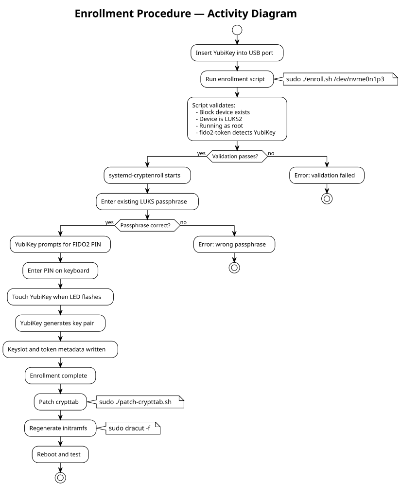
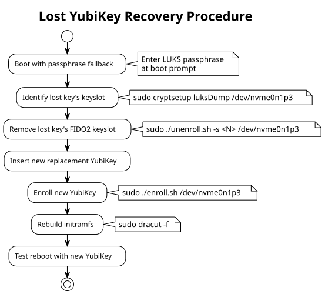

# Operations Guide

## Procedures for FIDO2 YubiKey LUKS2 Management

---

## 1. Prerequisites

### 1.1 Hardware Requirements

| Component | Requirement |
|-----------|------------|
| YubiKey | YubiKey 5 series (5, 5C, 5Ci, 5 NFC, 5C NFC) with firmware 5.0+ |
| USB | USB-A or USB-C port accessible during boot (BIOS/UEFI must initialize USB early) |
| Disk | Existing LUKS2 encrypted partition (LUKS1 is not supported) |

### 1.2 Software Requirements

| Package | Version | Purpose |
|---------|---------|---------|
| `systemd` | 252+ | Provides `systemd-cryptenroll` and `systemd-cryptsetup` |
| `libfido2` | 1.8+ | FIDO2 library for USB HID communication |
| `cryptsetup` | 2.4+ | LUKS2 management |
| `dracut` | any | Initramfs generator (Fedora default) |

### 1.3 Install Dependencies

```bash
sudo dnf install libfido2 libfido2-devel systemd cryptsetup
```

### 1.4 Verify YubiKey FIDO2 Support

```bash
# List connected FIDO2 devices
fido2-token -L

# Expected output (example):
# /dev/hidraw2: vendor=0x1050, product=0x0407 (Yubico YubiKey OTP+FIDO+CCID)

# Check FIDO2 capabilities
fido2-token -I /dev/hidraw2
```

### 1.5 Verify LUKS2

```bash
# Confirm device is LUKS2 (not LUKS1)
sudo cryptsetup luksDump /dev/nvme0n1p3 | head -5

# Expected: "Version: 2"
# If Version is 1, convert first (BACKUP DATA!):
# sudo cryptsetup convert --type luks2 /dev/nvme0n1p3
```

---

## 2. Enrollment Procedures

### 2.1 Enroll First YubiKey



**Step-by-step:**

```bash
# Step 1: Insert YubiKey
# Verify it's detected
fido2-token -L

# Step 2: Enroll
sudo ./enroll.sh /dev/nvme0n1p3
# — Enter your existing LUKS passphrase when prompted
# — Enter your YubiKey FIDO2 PIN when prompted
# — Touch the YubiKey when its LED flashes

# Step 3: Patch crypttab
sudo ./patch-crypttab.sh

# Step 4: Rebuild initramfs
sudo dracut -f

# Step 5: Reboot
sudo reboot
```

### 2.2 Enroll Additional YubiKey (Backup Key)

Each enrollment creates an independent keyslot. To enroll a second key:

```bash
# Remove first YubiKey, insert second YubiKey
fido2-token -L   # verify new key is detected

# Enroll (same command — creates a new keyslot)
sudo ./enroll.sh /dev/nvme0n1p3

# No need to re-run patch-crypttab.sh or dracut
# (already configured from first enrollment)
```

### 2.3 Enroll Combined TPM2 + FIDO2 (3-Factor)

Requires: systemd 253+, TPM2 hardware, YubiKey.

```bash
# Step 1: Verify TPM2 and YubiKey
ls /dev/tpmrm0        # TPM2 device must exist
fido2-token -L        # YubiKey must be detected

# Step 2: Enroll combined keyslot
sudo ./enroll-tpm-fido2.sh /dev/nvme0n1p3
# — Enter your existing LUKS passphrase when prompted
# — Enter your YubiKey FIDO2 PIN when prompted
# — Touch the YubiKey when its LED flashes

# Step 3: Patch crypttab for combined mode
sudo ./patch-crypttab.sh --mode tpm2-fido2

# Step 4: Rebuild initramfs
sudo dracut -f

# Step 5: Reboot
sudo reboot
```

**PCR re-enrollment after firmware/Secure Boot changes:**
```bash
# Remove old combined keyslot
sudo ./unenroll.sh --tpm2-fido2 /dev/nvme0n1p3

# Re-enroll with updated PCR values
sudo ./enroll-tpm-fido2.sh /dev/nvme0n1p3
sudo dracut -f
```

### 2.4 Verify Enrollment

```bash
# List all keyslots and tokens
sudo cryptsetup luksDump /dev/nvme0n1p3

# Look for:
# Tokens:
#   0: systemd-fido2
#        Keyslot:  1
#   1: systemd-fido2      (if second key enrolled)
#        Keyslot:  2
```

---

## 3. Boot Operations

### 3.1 Normal Boot (YubiKey Present)

1. Power on the system.
2. GRUB loads the kernel and initramfs.
3. `systemd-cryptsetup` reads `/etc/crypttab` and finds `fido2-device=auto`.
4. System displays: "Please insert security token for disk unlock."
5. Enter your FIDO2 PIN when prompted.
6. Touch the YubiKey when its LED flashes.
7. Disk unlocks. Boot continues normally.

### 3.2 Fallback Boot (No YubiKey)

1. If no FIDO2 device is detected within the timeout (default ~30 seconds):
2. System falls back to passphrase prompt: "Please enter passphrase for disk..."
3. Enter your LUKS passphrase.
4. Disk unlocks. Boot continues.

### 3.3 Boot Failure Scenarios

| Scenario | System Behavior | Resolution |
|----------|----------------|------------|
| YubiKey not inserted | Timeout → passphrase prompt | Enter passphrase or insert key |
| Wrong PIN entered | Retry prompt (max 8 retries) | Enter correct PIN |
| PIN locked (8 failures) | FIDO2 app locked | Use passphrase fallback; reset YubiKey FIDO2 app |
| YubiKey damaged | FIDO2 assertion fails | Use passphrase or backup YubiKey |
| initramfs missing libfido2 | No FIDO2 prompt, passphrase only | Run `dracut -f` from recovery |

---

## 4. Key Management

### 4.1 Remove a Specific YubiKey

```bash
# Find the keyslot number
sudo cryptsetup luksDump /dev/nvme0n1p3 | grep -A3 "systemd-fido2"

# Remove keyslot (e.g., slot 2)
sudo ./unenroll.sh -s 2 /dev/nvme0n1p3

# Rebuild initramfs
sudo dracut -f
```

### 4.2 Remove All YubiKeys

```bash
sudo ./unenroll.sh --all /dev/nvme0n1p3
sudo dracut -f
```

### 4.3 Replace a Lost YubiKey



### 4.4 Change YubiKey FIDO2 PIN

The FIDO2 PIN is managed by the YubiKey itself, independent of LUKS2:

```bash
# Using ykman (YubiKey Manager CLI)
sudo dnf install yubikey-manager
ykman fido access change-pin

# Or using fido2-token
fido2-token -C /dev/hidraw2
```

Changing the PIN does **not** require re-enrollment. The same PIN is used for all FIDO2 operations on that YubiKey.

### 4.5 Reset YubiKey FIDO2 App (Emergency)

If the PIN is locked (8 wrong attempts), the FIDO2 application must be reset. **This destroys all FIDO2 credentials on the key.**

```bash
# WARNING: Destroys ALL FIDO2 credentials on this YubiKey
ykman fido reset
```

After reset:
1. Boot using passphrase fallback.
2. Remove the old keyslot: `sudo ./unenroll.sh -s <N> /dev/nvme0n1p3`
3. Set a new PIN: `ykman fido access set-pin`
4. Re-enroll: `sudo ./enroll.sh /dev/nvme0n1p3`

---

## 5. Verification Checklist

### 5.1 Post-Enrollment Verification

```bash
# 1. FIDO2 keyslot exists
sudo cryptsetup luksDump /dev/nvme0n1p3 | grep "systemd-fido2"
# Expected: at least one "systemd-fido2" token

# 2. Passphrase keyslot still exists (for recovery)
sudo cryptsetup luksDump /dev/nvme0n1p3 | grep "Keyslots:" -A 20
# Expected: keyslot 0 should still be type "luks2" (passphrase)

# 3. crypttab has fido2-device=auto
grep "fido2-device" /etc/crypttab
# Expected: fido2-device=auto in options

# 4. initramfs contains libfido2
lsinitrd /boot/initramfs-$(uname -r).img | grep fido2
# Expected: libfido2.so files present
```

### 5.2 Annual Security Review Checklist

- [ ] Verify passphrase keyslot is still active (recovery capability)
- [ ] Test passphrase unlock without YubiKey (confirm fallback works)
- [ ] Verify enrolled YubiKey firmware version (check for advisories at https://www.yubico.com/support/security-advisories/)
- [ ] Review keyslot inventory (`cryptsetup luksDump`) — remove unused slots
- [ ] Verify FIDO2 PIN is known and PIN retry counter is not near exhaustion
- [ ] Confirm backup YubiKey is enrolled and accessible
- [ ] Test boot with backup YubiKey

---

## 6. Troubleshooting

| Symptom | Likely Cause | Resolution |
|---------|-------------|------------|
| `fido2-token -L` shows nothing | YubiKey not connected or USB not initialized | Try different USB port; check `dmesg` for USB errors |
| `systemd-cryptenroll` fails with "No FIDO2 device" | `libfido2` not installed or wrong permissions | `sudo dnf install libfido2`; run as root |
| Boot hangs at "Insert security token" | YubiKey not inserted or USB not available in initramfs | Insert key; if USB not working, wait for passphrase fallback |
| "Wrong PIN" repeated | User entering wrong PIN | 8 attempts total; if locked, use passphrase and reset FIDO2 app |
| `dracut -f` fails | Missing dependencies | `sudo dnf install libfido2`; check `/etc/dracut.conf.d/` |
| After kernel update, no FIDO2 prompt | New initramfs missing FIDO2 libs | Run `sudo dracut -f` for new kernel |
